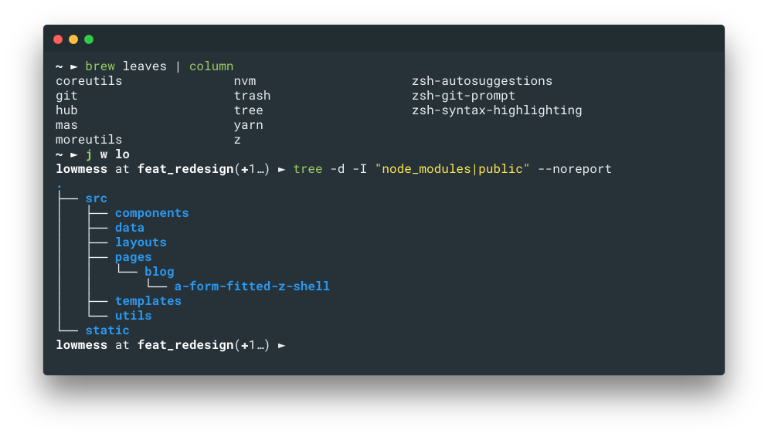

I was scared of the terminal for a long time. For a while, I got by: there are plenty of apps to compile Sass files. But
as I grew frustrated with the limitations of GUI solutions, I took the time to familiarize myself with the command line.
As with any other tool I eventually went through
[several obsessive rounds](https://twitter.com/lowmess/status/903714807022469120) of tweaking and updating the terminal
to my liking. Now, instead of being scared of the terminal, I don't completely hate it. Here's some of the ways I did
that.

## The Light at the End of the Tunnel

After going through all of this, this is what my terminal looks like. I prefer a minimal setup, but there's a lot of
features hidden underneath the simple exterior. Like a spooky skeleton.



## Frameworks: Almost Certainly All You Need

Frameworks like [`oh-my-zsh`](http://ohmyz.sh/) and [`prezto`](https://github.com/sorin-ionescu/prezto) are awesome, and
originally what sent me down this crazy path. However, over time I became dissatisfied with them. The problem--which,
really, says much more about me than the frameworks--was that they're simply _too_ powerful. There are too many
functions and aliases and configuration options for me to easily wrap my mind around. So, rather than do the normal
thing (read some docs and root around in the repo), I decided to spend a few hours to make a shell setup that has like
5% of the functionality.

I concede that doing the exact opposite of this is not only completely justified, but probably much smarter as well.

## Wheels Are for Sweet Bike Jumps, Not Reinvention

Fortunately, developer tooling is a realm where open source truly shines. There are literally dozens of FOSS projects
that offer a more focused take on shell improvement. Chief among these is [Homebrew](https://brew.sh/), which helps me
install [these other libraries](https://github.com/unixorn/awesome-zsh-plugins#plugins) with just a few keystrokes. Here
are a few of my other favorites.

### [`zsh-git-prompt`](https://github.com/olivierverdier/zsh-git-prompt)

The first thing that caused me to switch from `bash` to `zsh` and to use frameworks like `oh-my-zsh` was the ability to
see my `git` status right in my prompt. I later realized that it was entirely possible to achieve without using either
of those things, but it's a still a good segue. This appropriately-named project helps make that easy, and after
[some quick configuration](https://github.com/lowmess/dotfiles/blob/e7bc15f22ba756a0106285229e0c930ee4f6dd0a/.zshrc#L24-L41),
I was able to get my prompt looking just as I like it.

### [`zsh-syntax-highlighting`](https://github.com/zsh-users/zsh-syntax-highlighting)

Another convenient thing the frameworks bring is syntax highlighting. I can't count the amount of times highlighting has
prevented me from typing `gti` (a type of car) instead of `git` (a cool and good technology). Just source this
also-appropriately-named package at the end of your `.zshrc` and be dazzled at the pretty, prettily-informative colors.

### [`hub`](https://hub.github.com)

I am working in [GitHub](https://github.com) repos basically all day. And while those repos work just fine with vanilla
`git`, GitHub has a helper library to make working with repos on their service a little easier. `hub` allows you to do
basically anything you can do on the GitHub webapp right from your terminal. My favorite feature is `browse`, which
allows you to quickly open up a repo's GitHub page from the comfort of your keyboard instead of manually opening a tab
like a jackass.

### [`z`](https://github.com/rupa/z)

One of the first things I did when I started customizing my terminal was to set up custom aliases to jump into
directories from anywhere. Judging by some of my coworkers setups, this is far from uncommon. Luckily, `z` makes that
irrelevant. Instead of setting up new aliases for every directory, just `cd` into it one time, and then you can `z [name
of dir]` into it from anywhere. What sets `z` apart from similar libraries like
[`autojump`](https://github.com/wting/autojump) is a concept called "frecency". Basically, if you've been accessing a
directory a lot recently, `z` will score that directory higher than other similarly-named ones. Plus it sounds like the
name of a really bad action movie, and that's cool.

## Like a $3,000 Custom-Tailored Fingerless Glove

Now that we have all of the libraries we want installed, we can begin to craft aliases and functions to mold our
development environment to our own unique sensibilities. One of the major benefits I've found of doing this over using
frameworks is that any additional feature or effeciency in my shell is one that I introduced, which means that I
actually know about it and will use it. Probably. Honestly I give it like a 65% chance.

These can be simple:

```bash
# because typing an extra 7 chars is just too much work
alias r="yarn run"
```

These can be fun:

```bash
# yes, dude, the weather is fun
function weather () {
  curl -H "Accept-Language: ${LANG%_*}" wttr.in/"${1:-Tempe}"?0q
}
```

But the most important factor is that they're mine (or, in your case, yours).

## The Real Terminal Is the Friends We Made Along the Way

I am still the absolute furthest thing from an expert in this realm. But this process has made me a lot more comfortable
on the command line. I don't really have a great way to wrap this up, so I'll leave you with this:

1. If you _are_ an expert in this realm, come make fun of [my bad dotfiles repo](https://github.com/lowmess/dotfiles).
   If you're not an expert you can look at in awe or whatever.
1. Again, this entire process could have been avoided by just reading some docs. This was way more fun.
